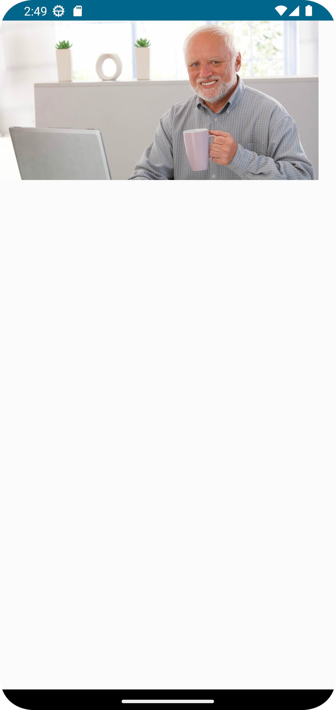

# Create and display inline ads
This tutorial will guide you through creating a simple application that can load and display a list of ads.

## Section 1: Getting started with AdSDK

Add and configure the AdSDK to create and load ads.

### Step 1:
Let's create a new Android project and remove all unnecessary code.
Make sure you have added the correct packages from the [readme](https://github.com/VM-Mobile-SDK/nextgen-adsdk-android-release).

### Step 2
The entry point into the SDK is the [AdService](https://vm-mobile-sdk.github.io/nextgen-adsdk-android-release/4.3.0/sdk_core/com.adition.sdk_core/-ad-service/index.html) class.
To make an easy start we just initialize the [AdService](https://vm-mobile-sdk.github.io/nextgen-adsdk-android-release/4.3.0/sdk_core/com.adition.sdk_core/-ad-service/index.html) in the `onCreate` method of the `MainActivity`.
This is the first thing we should create, as it will be used to generate advertisements in the future. 
To do this, we will add this code:
```kotlin 
runBlocking {
    val isSuccess = AdService.init("1800", applicationContext, EventHandler())
    Log.d("AdSDK", "Init is success: $isSuccess")
}
```
The only mandatory parameter when creating [AdService](https://vm-mobile-sdk.github.io/nextgen-adsdk-android-release/4.3.0/sdk_core/com.adition.sdk_core/-ad-service/index.html) is the [networkId](https://vm-mobile-sdk.github.io/nextgen-adsdk-android-release/4.3.0/sdk_core/com.adition.sdk_core/-ad-service/networkId.html). 
Network ID is the ID of your advertising account.
Our Code should now look like this:
```kotlin 
class MainActivity : ComponentActivity() {
    override fun onCreate(savedInstanceState: Bundle?) {
        super.onCreate(savedInstanceState)
        
        runBlocking {
            val isSuccess = AdService.init("1800", applicationContext, EventHandler())
            Log.d("AdSDK", "Init is success: $isSuccess")
        }
        
        setContent {
            AdsdkdemoappandroidTheme {

            }
        }
    }
}
```
### Step 3
The next step will be to create a composable, which we will display upon successful creation of [AdService](https://vm-mobile-sdk.github.io/nextgen-adsdk-android-release/4.3.0/sdk_core/com.adition.sdk_core/-ad-service/index.html). 
On this composable, we will be creating and displaying our advertisement.

```kotlin 
@Composable
fun AdView() {
    Text(
        text = "Advertisement should be here"
    )
}
```
Now we can call this in our composable in the `MainActivity`.
```kotlin 
class MainActivity : ComponentActivity() {
    override fun onCreate(savedInstanceState: Bundle?) {
        super.onCreate(savedInstanceState)

        runBlocking {
            val isSuccess = AdService.init("1800", applicationContext, EventHandler())
            Log.d("AdSDK", "Init is success: $isSuccess")
        }
        setContent {
            AdsdkdemoappandroidTheme {
                AdView()
            }
        }
    }
}
```

## Section 2: Loading and displaying advertisements

### Step 1
To create advertisements, we use the [Advertisement](https://vm-mobile-sdk.github.io/nextgen-adsdk-android-release/4.3.0/sdk_core/com.adition.sdk_core/-advertisement/index.html) object. To create [Advertisement](https://vm-mobile-sdk.github.io/nextgen-adsdk-android-release/4.3.0/sdk_core/com.adition.sdk_core/-advertisement/index.html) object, the only mandatory parameters are is the `contentUnit` and `adTypes`. 
Content Unit is the unique ID of your advertising space and for ad type we use [AdComposeRenderRegistry.getAllRendererNames()](https://vm-mobile-sdk.github.io/nextgen-adsdk-android-release/4.3.0/sdk_presentation_compose/com.adition.sdk_presentation_compose/-ad-compose-render-registry/get-all-renderer-names.html) this will enable all available `adTypes`. 
This method returns an [Advertisement](https://vm-mobile-sdk.github.io/nextgen-adsdk-android-release/4.3.0/sdk_core/com.adition.sdk_core/-advertisement/index.html) object, which essentially is the advertisement you will be displaying.
Another important parameter is `placementType`. In this case, we need [AdPlacementType.INLINE](https://vm-mobile-sdk.github.io/nextgen-adsdk-android-release/4.3.0/sdk_core/com.adition.sdk_core.internal.entities/-placement-type/-i-n-l-i-n-e/index.html), which is the default, so we ignore it.

```kotlin
@Composable
fun AdView() {
    var ad = Advertisement(
        "5192923",
        AdComposeRenderRegistry.getAllRendererNames()
    )
}
```

### Step 2
We can pass this [Advertisement](https://vm-mobile-sdk.github.io/nextgen-adsdk-android-release/4.3.0/sdk_core/com.adition.sdk_core/-advertisement/index.html) now to the [rememberAdState](https://vm-mobile-sdk.github.io/nextgen-adsdk-android-release/4.3.0/sdk_presentation_compose/com.adition.sdk_presentation_compose/remember-ad-state.html) composable:
The [rememberAdState](https://vm-mobile-sdk.github.io/nextgen-adsdk-android-release/4.3.0/sdk_presentation_compose/com.adition.sdk_presentation_compose/remember-ad-state.html) creates the [AdState](https://vm-mobile-sdk.github.io/nextgen-adsdk-android-release/4.3.0/sdk_presentation_compose/com.adition.sdk_presentation_compose/-ad-state/index.html) which we will use later. 
There are multiple versions of the [rememberAdState](https://vm-mobile-sdk.github.io/nextgen-adsdk-android-release/4.3.0/sdk_presentation_compose/com.adition.sdk_presentation_compose/remember-ad-state.html). 
For example we could pass a content unit directly to the [rememberAdState](https://vm-mobile-sdk.github.io/nextgen-adsdk-android-release/4.3.0/sdk_presentation_compose/com.adition.sdk_presentation_compose/remember-ad-state.html) and it would create the [Advertisement](https://vm-mobile-sdk.github.io/nextgen-adsdk-android-release/4.3.0/sdk_core/com.adition.sdk_core/-advertisement/index.html) for us. 
```kotlin
@Composable
fun AdView() {
    var ad = Advertisement(
        "5192923",
        AdComposeRenderRegistry.getAllRendererNames()
    )
    val adState = rememberAdState(advertisement = ad)
}
```

### Step 3
We can pass the [AdState](https://vm-mobile-sdk.github.io/nextgen-adsdk-android-release/4.3.0/sdk_presentation_compose/com.adition.sdk_presentation_compose/-ad-state/index.html) to [Ad](https://vm-mobile-sdk.github.io/nextgen-adsdk-android-release/4.3.0/sdk_presentation_compose/com.adition.sdk_presentation_compose/-ad.html) composable.
The [Ad](https://vm-mobile-sdk.github.io/nextgen-adsdk-android-release/4.3.0/sdk_presentation_compose/com.adition.sdk_presentation_compose/-ad.html) is the main composable used to display the ad with provided `adState`.
```kotlin
@Composable
fun AdView() {
    var ad = Advertisement(
        "5192923",
        AdComposeRenderRegistry.getAllRendererNames()
    )
    val adState = rememberAdState(advertisement = ad)
    Ad(adState = adState, modifier = Modifier)
}
```

Now we should see the Banner on our device:
<br>
